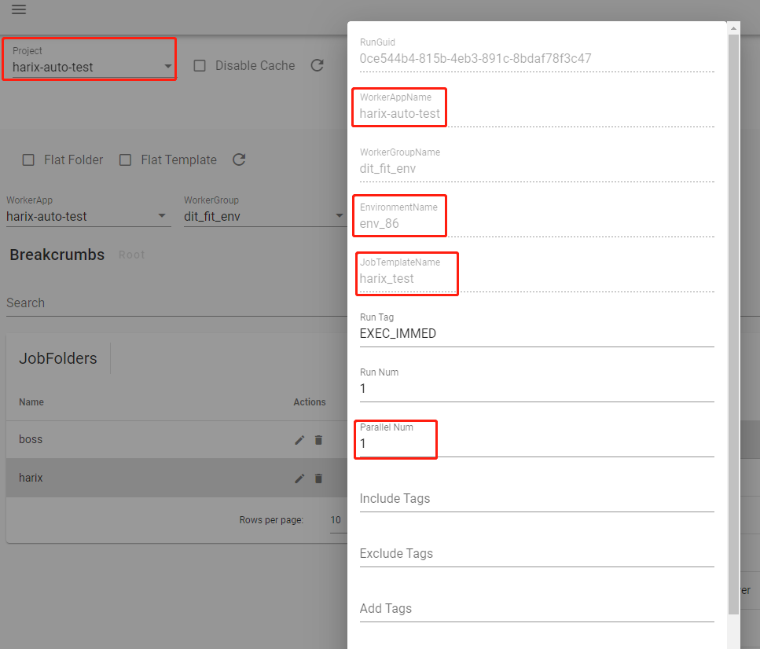

zhiyoufy是一个自动化测试平台，提供project、job template、environment、worker app等的管理，具体测试的运行，schedule，
查看结果等。

+ 用户：用户具有不同的role，从而具有不同的权限
+ project: project是job template的拥有者
+ job template: job template对应具体的工作，运行时需要不同的config，需要在拥有指定worker label的worker上运行
+ environment: environment是config的拥有者
+ config: 分为config single和config collection，其中config single意思是只有一个，config collection代表一个config的集合，
里头的每项叫config item，比如被测平台账户，同一个config collection里的config item应该是对等的，创建run时会随机从中间抽取空闲的
+ worker app: 具体执行测试的应用
+ job run：通过指定template和environment来创建在指定environment下针对template的测试，run中还会配置parallel_num，也就是并发度，比如可以配置为50，那就会选取50套
config并给启动50套测试

## sample job run

在下面的示例中涉及的各部分配置是

- project: harix-auto-test
- job template: harix_test
- environment: env_86
- worker app: harix-auto-test
- 并发配置: parallem num为1

