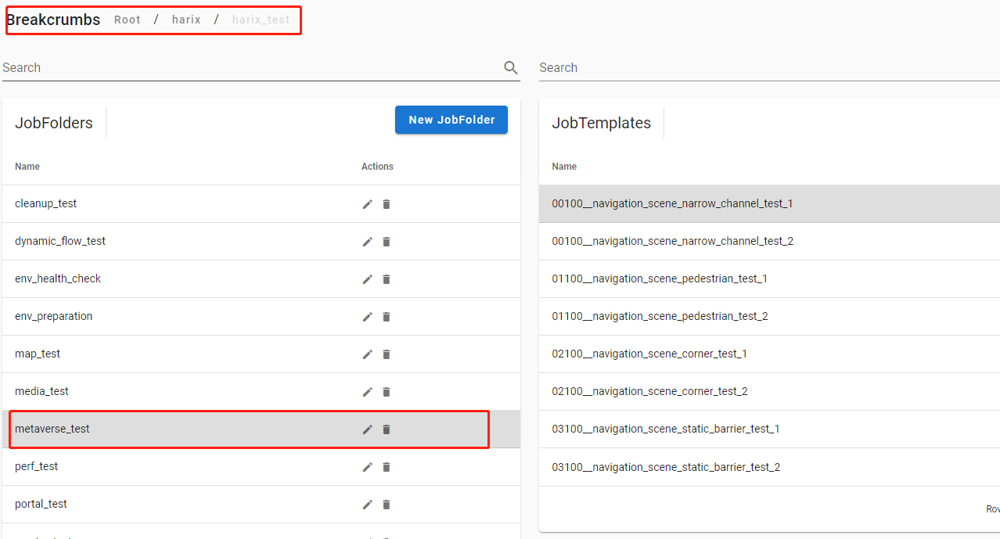
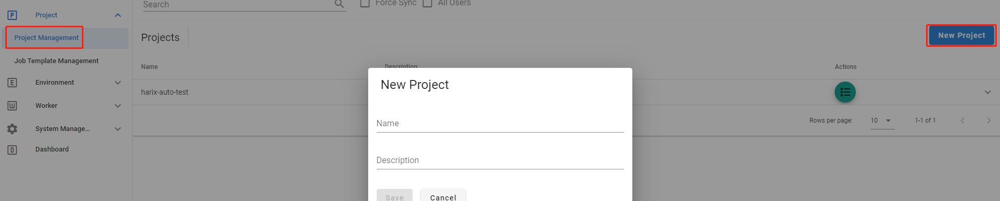

project是job template的拥有者。

## project划分

可以从job template的使用者角度来将job template划分到不同的project中，从而使用户只看到相关的job template。

也可以从job template的开发者角度将job template划分到不同的project中，从而开发者只看到自己负责的job template。

## project内部job template组织

类似目录组织方式，双击进入下一级目录，选中展示当前目录包含的job template，示例如下

其中Breadcrumb代表当前的目录路径，可以点击跳转

## 新建project

新建project需要特定权限，示例界面如下

