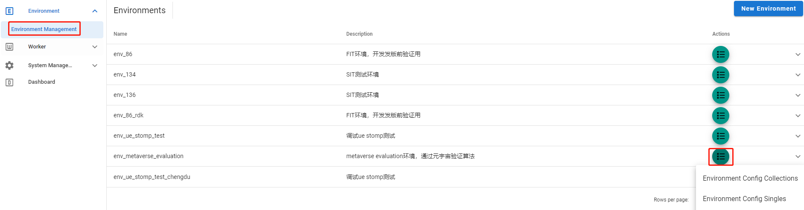

环境是配置的集合，最常见的是被测系统的接入地址

## config分类

配置分为single和collection两个方面

- single指的是只有一份的，比如系统的接入地址
- collection指的是有多份的，比如被测系统的用户，有可能当并发时不同实例需要使用不同的用户

## 前端管理页面

## config整合

当运行job run时需要动态整合config然后传给worker，假设一个job template需要

- config single A, config single B
- config collection O, config collection P

并且运行job run时选择了并行运行3个，那么会获取当前config single A和config single B，
然后再分别从config collection O和P中各获取3份空闲的config item，比如O1, O2, O3, P1, P2, P3，
然后组装成3个组合

- A, B, O1, P1
- A, B, O2, P2
- A, B, O3, P3

然后发送给worker分别执行
