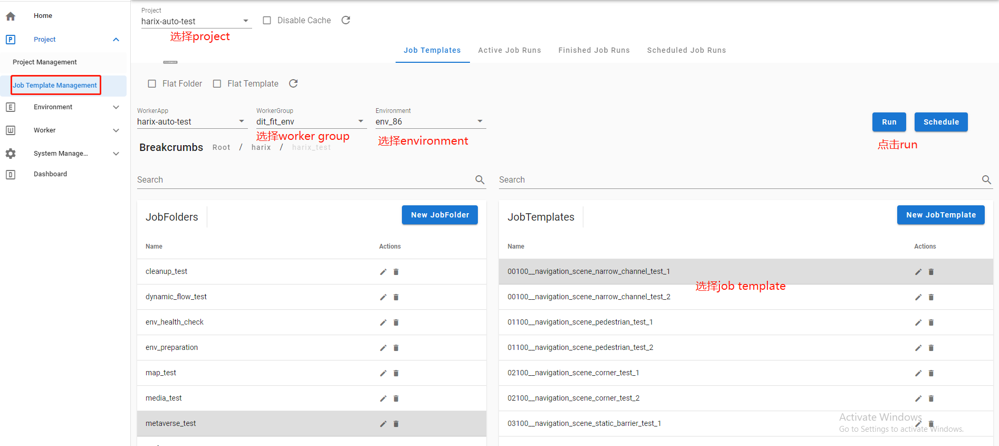
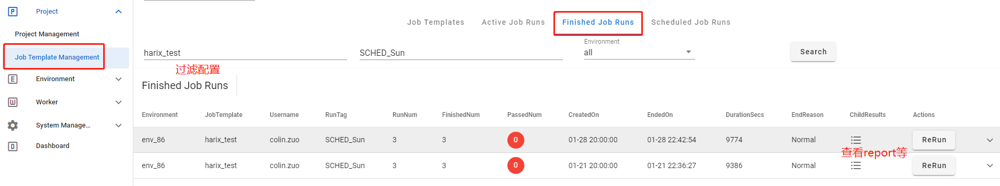
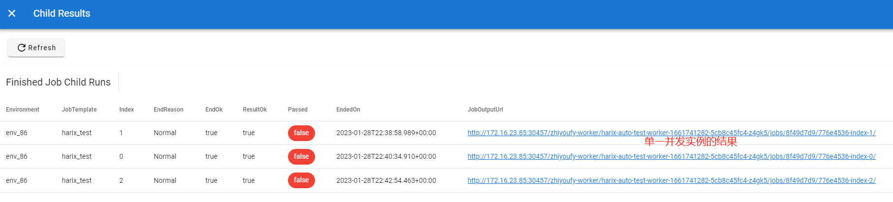
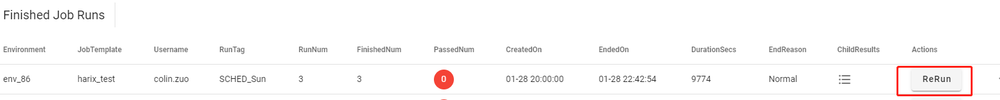

## 基本工作流程

- 选择project
- 选择worker group
- 选择环境
- 选择job template
- 点击run并配置并发等参数
- 在active job runs标签下查看运行状态
- 在Finished Job Runs标签下查看运行结果，比如report，log等
 
## 示例part 1

## 查看运行结果

点进去后在路径`robotframework_output/log.html`下就能看到具体的report和log

## rerun

对于之前运行过的job run，如果参数没变，可以在Finished Job Runs的对应项上通过点击Rerun来重新运行

