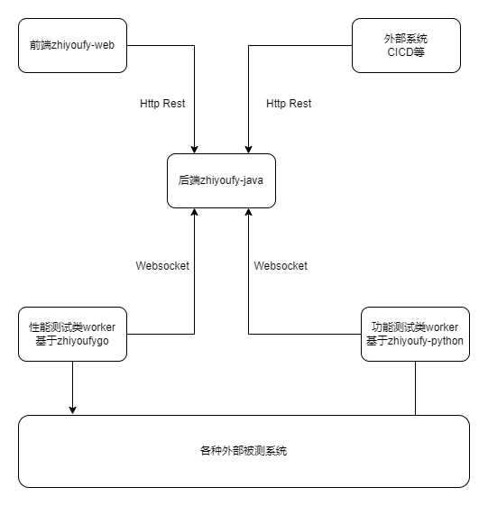

zhiyoufy是一套基于**[RobotFramework][], [pyhocon][], [jinja][]**等开发的自动化测试框架

如果只是开发worker，则只需要了解zhiyoufy-python部分，其它部分通过用户指南会使用就行。

## Robot Framework

[RobotFramework][]是基于keyword的test系统，比如keyword “Login”，keyword “Input ***”，基于我们的情况，我们这里采用一个case都由单一keyword加配置文件组成，并在配置文件中详细描述测试步骤

相比原生的优点
- 当传递复杂的参数时更清晰
- 可断点调试

### 如何控制让一个case失败

[RobotFramework][]本身就是在普通的python程序里跑，它是通过catch Exception来判断case失败的，当我们写的测试程序判断case失败，比如api返回码不符合预期时，只要抛出异常就可以导致对应case失败
``` python
    if delay > timedelta(seconds=data["max_delay"]):
        raise Exception("delay %s larger than max_delay %s" % (delay, data["max_delay"]))
```

### RobotFramework原生用法
```
*** Settings ***
Documentation     A test suite with a single test for valid login.
...
...               This test has a workflow that is created using keywords in
...               the imported resource file.
Resource          resource.txt

*** Test Cases ***
Valid Login
    Open Browser To Login Page
    Input Username    demo
    Input Password    mode
    Submit Credentials
    Welcome Page Should Be Open
    [Teardown]    Close Browser
```

## json描述的case

[RobotFramework][]是在它的case文件中组织具体测试步骤，但是在case文件中配置大量参数比较受限，可读性也不好。  

类似于[RobotFramework][]自己的keyword组合系统，但我们采用json配置文件来方便各测试步骤参数的配置，并且利用[jinja][]的
模板能力来进一步增加灵活性，在测试代码中实现各种功能指令，然后在json文件中指定指令的顺序和对应配置

### case示例

可以在下面示例中看到在[RobotFramework][]的case中只有一个`TestDynamicFlow.run`调用，它的参数就是对应case的json步骤描述

```
*** Settings ***
Documentation     A test suite for Dynamic Flow
...
...               Config Single CRUD
Resource          ../../global_resource.robot
Library           zhiyoufy.app.TestDynamicFlow   WITH NAME    TestDynamicFlow
Force Tags        nostat-00100__config_single_crud

*** Test Cases ***
Test Config Single CRUD
    TestDynamicFlow.run  dynamic_flows_from_tpl/dynamic_flow_test/00100__config_single_crud.json.j2
```

### case步骤配置文件示例

每一步都是一个json object，当参数复杂时也很清晰，另外还通过[pyhocon][]和[jinja][]提供了动态配置的能力

```json
  "datas": [
    {
      "type": "zhiyoufy_base_login",
      "username": "{{ zhiyoufy.user_params_group_3.username }}",
      "password": "{{ zhiyoufy.user_params_group_3.password }}"
    },

    {
        "type": "zhiyoufy_environment_get_single_by_name",
        "environment_var_path": "environment_var",
        "name": "{{ env_name }}",
        "must_exist": true,
        "step_description": "查找名字为name的environment"
    },
```

## 自动化配置

配置文件我们采用[hocon](https://github.com/lightbend/config/blob/master/HOCON.md)，它的变量覆盖，merge等功能
让动态组合config变的容易

### [JSON superset features](https://github.com/lightbend/config)

相比json多的功能

+ comments
+ includes, 包含子文件，或者说文件嵌套
+ 变量覆盖，后面的赋值覆盖前面的
+ substitutions `("foo" : ${bar}, "foo" : Hello ${who})`
+ properties-like notation `(a.b=c)`
+ less noisy, more lenient syntax
+ substitute environment variables `(logdir=${HOME}/logs)`

### 读取配置

首先在执行测试脚本时设置配置文件，相关代码如下, global_library_config就是配置文件路径

```python
    cmd = "robot --outputdir %s --tagstatexclude nostat-* --variable global_library_config:%s %s %s %s %s" % \
          (run_output_dir, config_inst.global_library_config, additional_python_path,
           test_include, test_exclude, config_inst.test_target)
```

然后在跑具体测试case时将这个配置文件传递进去，相关代码如下，
GlobalLibrary这个python库会从指定路径读取配置文件

```
*** Settings ***
Library           zhiyoufy.app.GlobalLibrary  ${global_library_config}  WITH NAME    GlobalLibrary
```

具体配置文件示例

```text
zhiyoufy: {
  addr: "http://localhost:8088"

  default_update_if_exist: false,
```

## 自动化执行

执行是通过python的[subprocess](https://docs.python.org/3.8/library/subprocess.html)模块来调用robot程序，robot是[RobotFramework][]提供的一个命令行程序，相关代码如下

```python
            cmd = f"robot --outputdir {robotframework_output_dir} --tagstatinclude stat-*" \
                  f" --variable global_library_config:{dst_base_conf_path} {self.additional_python_path}" \
                  f" {self.extra_args} {abs_test_suite_path}"

            proc = subprocess.Popen(cmd, shell=True, stdout=subprocess.PIPE,
                stderr=subprocess.STDOUT, text=True, encoding="utf-8")
```

### zhiyoufy执行

在zhiyoufy中是`worker`在接到从`zhiyoufy-java`发来的请求后触发执行的

### 本地执行

可参照`zhiyoufy-python/run_robot_zhiyoufy_test.py`编写一个本地触发的脚本，在提交代码前可以通过它来验证

## case组织

因为是基于[RobotFramework][]，所以组织上是基于目录和tag的

### 前端目录规则

template目录应与真实RobotFramework目录一一对应，这样利于维护也好理解

特殊情况可创建虚拟目录，应以前缀**virtual_**区分

目录对应的template在zhiyoufy上归属于上级目录

假设RobotFramework的目录结构为
- A1
  + A1_1
  + A1_2
- B1
  + B1_1
  + B1_2
- C1
  + C1_1
  + C1_2

则zhiyoufy portal上也有对应的这几个目录

然后比如A1_1这个目录，它的上级目录是A1，那A1_1对应的template在zhiyoufy上创建在A1上

如果目录对应的template比较多，放在上级目录会比较乱，这时候可以在原目录下创建虚拟目录来管理，
比如加入A1_1有10种不同template，那可以在A1_1下创建虚拟目录比如**virtual_A1_1**

### 准备类

case运行有的需要有一些前置条件，比如用户存在，如果有撰写自动化脚本来做准备工作，那应该把准备工作放到独立的目录中，
这样可以让case更简练易懂，当然可以在case描述中写清楚依赖项

准备类可以按不同原则分类，比如产品，比如账号组

不同脚本的执行次数可能也不一样，比如有的账号组有100个，有的只有5个，那么不能简单的让所有脚本执行
多少次

这种情况可能没有简单的方法适应各种情况，需要按照实际需要设计脚本执行顺序，执行次数，然后用文档记录下来，
这部分应该还是准备好后人工按照文档执行比较稳妥，因为准备类应该是很低频的，所以效率不是问题。

## 自动化部署

- `worker`可以打包成docker image
- 如果`worker`可以部署在云端，则建议通过`helm`部署到k8s环境中

## zhiyoufy架构



## zhiyoufy-java

使用java开发的服务器后端，用于管理环境、project、app等

## zhiyoufy-web

使用vue开发的前端应用，用户可以通过这个创建环境、project等

## zhiyoufy-python

开发功能测试worker时基础的功能封装，比如config的解析，不同util的封装等

## zhiyoufy-go

开发性能测试worker时基础的功能封装，比如script的解析，基本command handler，job的运行等

## clients及handler封装

这个不同用户可以按需做封装，比如用户有A、B、C三个产品，它可以创建一个repo，然后
在里面包含3个clients和对应handler，也可以建立多个repo，在里面相应封装

这个不和worker放在一起的目的是为了复用，clients封装主要关注目标产品功能client侧
的封装，它并不关注具体的测试case

## worker工程

worker工程主要关注case的构建，首先它会依赖`zhiyoufy-python`，其次它会依赖case中
涉及的不同clients，worker工程代码比较少，主要是case描述和一些资源文件

一个worker如果被测产品涉及ProductAaa, ProductBbb，那么它就可以引入依赖ProductAaaClient,
ProductBbbClient

另一个worker如果被测产品涉及ProductBbb, ProductCcc，那么它就可以引入依赖ProductBbbClient,
ProductCccClient

这里client部分就被复用，从而减少维护成本

### 代码部分

这里代码一个是handler的注册，比如

```python
        self.add_handler(DynamicFlowProductAaaClient())
        self.add_handler(DynamicFlowProductBbbClient())
```

一个是GlobalLibraryBase中对config的默认配置

```python
        if "long_timeout" not in test_step_dynamic:
            test_step_dynamic.long_timeout = 180
```

[RobotFramework]: https://robotframework.org
[pyhocon]: https://github.com/chimpler/pyhocon
[jinja]: https://jinja.palletsprojects.com/en/2.10.x/


